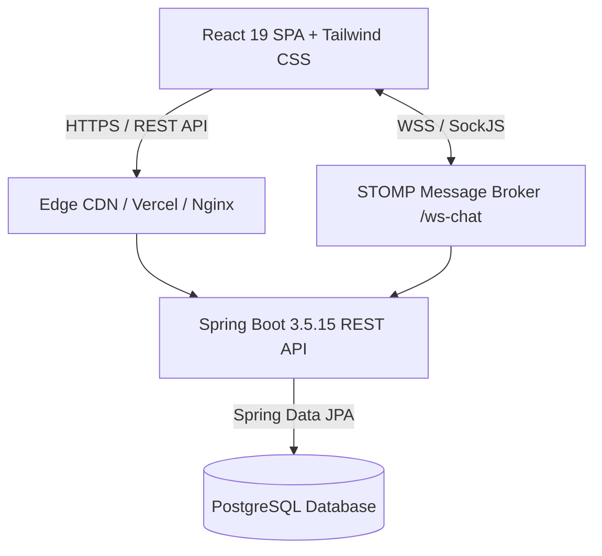

<div align="center">

# 💼 Recruitment & Job Portal System 

**Enterprise-Grade Applicant Tracking System & Talent Acquisition Platform**

[](https://openjdk.org/)
[](https://spring.io/projects/spring-boot)
[](https://react.dev/)
[](https://vitejs.dev/)
[](https://tailwindcss.com/)
[](https://www.postgresql.org/)
[](https://stomp.github.io/)
[](https://recruitment-job-portal-system.onrender.com)
[](https://recruitment-job-portal-system.vercel.app)
[](LICENSE)

<p align="center">
  A modern, high-performance Recruitment & Applicant Tracking System (ATS) connecting <b>Enterprise Admins</b>, <b>Corporate Clients</b>, <b>Recruitment Partners</b>, and <b>Candidates</b> with real-time collaboration, candidate pipelines, and automated hiring workflows.
</p>

</div>

---

## 🌐 Live Deployments & Demo

| Service | Provider | Live URL | Status |
| :--- | :--- | :--- | :--- |
| **Frontend Web App** | **Vercel** | [recruitment-job-portal-system.vercel.app](https://recruitment-job-portal-system.vercel.app) |  |
| **Backend REST & WS API** | **Render** | [recruitment-job-portal-system.onrender.com](https://recruitment-job-portal-system.onrender.com) |  |
| **Cloud Database** | **Neon PostgreSQL** | Serverless PostgreSQL (AWS us-east-2) |  |

> ℹ️ **Note on Cold Starts**: The backend API is hosted on Render's free tier. If the instance has spun down due to inactivity, the initial request may take ~30–50 seconds to boot up. Subsequent interactions are fast.

---

## 📑 Table of Contents

- [Live Deployments & Demo](#-live-deployments--demo)
- [Key Features](#-key-features)
- [System Architecture](#-system-architecture)
- [Tech Stack](#-tech-stack)
- [Role-Based Access Control (RBAC)](#-role-based-access-control-rbac)
- [Project Structure](#-project-structure)
- [REST API Reference](#-rest-api-reference)
- [Real-Time WebSocket Protocol](#-real-time-websocket-protocol)
- [Getting Started Locally](#-getting-started-locally)
  - [Prerequisites](#prerequisites)
  - [Backend Setup](#backend-setup)
  - [Frontend Setup](#frontend-setup)
- [Deployment Guide](#-deployment-guide)
  - [Cloud Production Deployment (Render + Neon + Vercel)](#cloud-production-deployment-render--neon--vercel)
  - [Alternative: Railway + Vercel](#alternative-railway--vercel)
  - [Docker Deployment](#docker-deployment)
- [Environment Variables](#-environment-variables)
- [Author & Credits](#-author--credits)

---

## 🚀 Key Features

### 🏢 Multi-Tenant Collaboration & Role Workflows
- **Super Admin & Admin**: Full system governance, requisition approval, client & partner onboarding, account activation control, and system metrics.
- **Client Accounts**: Create requisitions, review assigned partner candidates, conduct evaluations, and track requisition fulfillment.
- **Recruitment Partners**: Access assigned requisitions, submit vetted candidates with resume attachments, track candidate progression across stages.
- **Candidates**: Profile management, resume upload, requisition exploration, and self-service application tracking.

### 📊 6-Stage Interactive Talent Pipeline
- Visual Kanban workflow supporting **6 core hiring stages**:
  `APPLIED` ➔ `SHORTLISTED` ➔ `INTERVIEW` ➔ `OFFERED` ➔ `HIRED` ➔ `REJECTED`
- Stage advancement modals with real-time candidate updates, quick actions, and requisition-based filtering.

### 💬 Real-Time STOMP Collaboration Chat
- **Instant Messaging**: Real-time bidirectional messaging via STOMP over SockJS (`/ws-chat`) with automatic REST fallback.
- **Dynamic Activity Sorting**: Conversations dynamically elevate to the top upon receiving or sending messages, identical to modern communication apps (WhatsApp/Slack).
- **Presence & Delivery Status**: Real-time online/offline presence indicators, unread notification counter badges, and delivered/seen receipt acknowledgments.

### 🎯 Robust Requisitions & Candidate Directory
- **Requisition Management**: Full lifecycle management including status locks, partner assignment with allocation quotas, and salary/skills configuration.
- **Candidate Database**: Comprehensive directory featuring real-time email/contact duplication checks, skill tagging, and multi-file document attachments.

### 🔒 Enterprise Security
- **Stateless JWT Security**: Encrypted JSON Web Tokens with automated silent refresh token rotation and 401 interceptor recovery.
- **CSRF Defense**: Double-submit cookie CSRF protection with custom exception matchers for public endpoints.
- **Granular RBAC**: Strict method-level (`@PreAuthorize`) and URL-level security enforcement across all REST endpoints.

---

## 🏗 System Architecture



---

## 🛠 Tech Stack

### Frontend
- **Framework**: React 19 (Hooks, Context API)
- **Tooling**: Vite 8.x, Rollup
- **Styling**: Tailwind CSS v4, Lucide React Icons
- **HTTP & State**: Axios with Request/Response Interceptors, React Router v6
- **Real-Time**: `@stomp/stompjs`, `sockjs-client`

### Backend
- **Framework**: Spring Boot 3.5.15
- **Language**: Java 21 (Virtual Threads, Pattern Matching)
- **Security**: Spring Security 6, JWT (io.jsonwebtoken), BCrypt, Cookie-based CSRF
- **Persistence**: Spring Data JPA, Hibernate, PostgreSQL Driver
- **Messaging**: Spring WebSocket, STOMP Messaging Protocol
- **Utilities**: Lombok, Validation API

---

## 👥 Role-Based Access Control (RBAC)

| Feature | SUPER_ADMIN | ADMIN | CLIENT | PARTNER | CANDIDATE |
| :--- | :---: | :---: | :---: | :---: | :---: |
| **Manage Admins / System Settings** | ✅ | ❌ | ❌ | ❌ | ❌ |
| **Manage Users & Activation** | ✅ | ✅ | ❌ | ❌ | ❌ |
| **Create & Close Jobs** | ✅ | ✅ | ✅ | ❌ | ❌ |
| **Assign Partners to Jobs** | ✅ | ✅ | ❌ | ❌ | ❌ |
| **Submit Candidates** | ✅ | ✅ | ❌ | ✅ | ❌ |
| **Advance Pipeline Stages** | ✅ | ✅ | ✅ | ❌ | ❌ |
| **Apply to Jobs Directly** | ❌ | ❌ | ❌ | ❌ | ✅ |
| **Real-Time Omnichannel Chat** | ✅ | ✅ | ✅ | ✅ | ✅ |

---

## 📂 Project Structure

```
recruitment-job-portal-system/
│
├── jobportal/                       # Spring Boot 3 Backend
│   ├── src/main/java/com/kiwisoft/jobportal/
│   │   ├── config/                  # WebSocket, CORS, Presence listeners
│   │   ├── controller/              # REST & MessageMapping controllers
│   │   ├── dto/                     # Request, Response & Chat DTOs
│   │   ├── entity/                  # JPA Data Models (User, Job, Candidate, Chat...)
│   │   ├── enums/                   # Role, JobStatus, Stage enums
│   │   ├── repository/              # Spring Data JPA repositories
│   │   ├── security/                # JwtFilter, SecurityConfig, PasswordEncoder
│   │   └── service/ & impl/         # Core business logic implementations
│   ├── src/main/resources/
│   │   └── application.yaml         # Cloud-ready environment configuration
│   ├── Dockerfile                   # Multi-stage lightweight Alpine build
│   └── pom.xml                      # Maven project configuration
│
└── jobportal-frontend/              # React 19 Frontend
    ├── src/
    │   ├── components/
    │   │   ├── common/              # SaaS Design System (Card, Button, Modal, Badge...)
    │   │   ├── chat/                # Real-time ChatPanel & floating widgets
    │   │   └── ui/                  # Responsive Navbar & Sidebar layouts
    │   ├── context/                 # AuthContext & Session management
    │   ├── pages/                   # Dashboard, Jobs, Candidates, Pipeline, Partners...
    │   ├── routes/                  # AppRouter & ProtectedRoute guards
    │   └── services/                # Axios API instances, ChatService, CSRF service
    ├── vercel.json                  # SPA routing configuration for Vercel
    ├── package.json                 # Frontend dependencies and scripts
    └── vite.config.js               # Vite bundler & plugin configuration
```

---

## 📡 REST API Reference

### 🔐 Authentication (`/api/auth`)
- `POST /api/auth/register` — Register a new user account
- `POST /api/auth/login` — Authenticate and receive access token & refresh cookie
- `POST /api/auth/refresh` — Issue a new access token via refresh token rotation
- `POST /api/auth/logout` — Invalidate user session & clear cookies
- `POST /api/auth/forgot-password` — Request password reset email
- `POST /api/auth/reset-password` — Finalize password reset

### 💼 Jobs & Requisitions (`/api/jobs`)
- `GET /api/jobs` — Retrieve paginated list of requisitions
- `GET /api/jobs/{id}` — Fetch requisition details and associated metrics
- `POST /api/jobs` — Create a new requisition requisition (Admin / Client)
- `PUT /api/jobs/{id}` — Update requisition details
- `POST /api/jobs/{id}/close` — Close/Archive a job requisition
- `POST /api/jobs/{id}/assign-partner` — Delegate requisition to a recruitment partner

### 🧑‍💼 Candidates (`/api/candidates`)
- `GET /api/candidates` — Search and filter candidate talent pool
- `GET /api/candidates/{id}` — Get comprehensive candidate profile
- `POST /api/candidates` — Create candidate profile (with duplicate check)
- `PUT /api/candidates/{id}` — Edit candidate details
- `DELETE /api/candidates/{id}` — Soft delete candidate record

### 🔄 Recruitment Pipeline (`/api/jobs/{jobId}/applications`)
- `GET /api/jobs/{jobId}/applications` — View all applicants grouped by stage
- `POST /api/jobs/{jobId}/applications` — Submit candidate application for a job
- `PUT /api/jobs/{jobId}/applications/{appId}/stage` — Advance candidate pipeline stage

### 💬 Omnichannel Messaging (`/api/chat`)
- `GET /api/chat/users` — List active chat contacts
- `GET /api/chat/conversation` — Fetch message history between two users
- `GET /api/chat/presence` — Retrieve real-time online status map
- `POST /api/chat/send` — Send message via REST fallback
- `PUT /api/chat/conversation/seen` — Mark message history as seen
- `PUT /api/chat/conversation/delivered` — Mark messages as delivered

---

## ⚡ Real-Time WebSocket Protocol

| Destination | Type | Description |
| :--- | :---: | :--- |
| `/ws-chat` | Endpoint | STOMP connection endpoint (SockJS enabled) |
| `/app/send` | Publish | Send outgoing message payload |
| `/topic/messages/{email}` | Subscribe | Receive personal incoming messages |
| `/topic/presence` | Subscribe | Receive real-time online/offline presence broadcasts |

---

## 💻 Getting Started Locally

### Prerequisites
- **JDK 21** ([Microsoft Build of OpenJDK](https://learn.microsoft.com/en-us/java/openjdk/download) or Eclipse Temurin)
- **Node.js 18+** & `npm`
- **PostgreSQL 14+** running locally

### 1. Database Setup
Create a PostgreSQL database named `jobportal`:
```sql
CREATE DATABASE jobportal;
```

### 2. Backend Setup
```bash
# Navigate to the backend directory
cd jobportal

# Run with Maven (Windows)
.\mvnw.cmd spring-boot:run

# Run with Maven (Linux/macOS)
./mvnw spring-boot:run
```
*The backend starts at `http://localhost:8080`.*

### 3. Frontend Setup
```bash
# Navigate to the frontend directory
cd jobportal-frontend

# Install dependencies
npm install

# Start Vite development server
npm run dev
```
*The frontend starts at `http://localhost:5173`.*

---

## 🚀 Deployment Guide

### Cloud Production Deployment (Render + Neon + Vercel)

The live production deployment is orchestrated across **Render** (Backend Docker Container), **Neon** (Serverless PostgreSQL), and **Vercel** (Frontend Edge SPA).

#### 1. Database Provisioning (Neon PostgreSQL)
1. Create a serverless PostgreSQL database at **[Neon.tech](https://neon.tech)**.
2. Note your database connection credentials:
   - Host: `ep-*-pooler.<region>.aws.neon.tech`
   - Database: `neondb`
   - User: `neondb_owner`
   - Parameter: `sslmode=require`

#### 2. Backend Web Service (Render)
1. Connect your repository on **[Render.com](https://render.com)** as a **Web Service**.
2. Select **Docker** environment (Render automatically detects [`jobportal/Dockerfile`](jobportal/Dockerfile)):
   - **Root Directory**: `jobportal`
   - **Docker Command / Context**: defaults
3. Configure Environment Variables in Render Dashboard:
   - `SPRING_DATASOURCE_URL` = `jdbc:postgresql://<neon-host>/neondb?sslmode=require`
   - `SPRING_DATASOURCE_USERNAME` = `<neon-user>`
   - `SPRING_DATASOURCE_PASSWORD` = `<neon-password>`
   - `JWT_SECRET_KEY` = `<strong-secret-key-min-32-chars>`
   - `CORS_ALLOWED_ORIGINS` = `https://recruitment-job-portal-system.vercel.app,http://localhost:5173`
4. Deploy the service.

#### 3. Frontend Web App (Vercel)
1. Import the repository on **[Vercel](https://vercel.com)**.
2. Set **Root Directory** to `jobportal-frontend`.
3. Set **Framework Preset** to `Vite`.
4. Configure Environment Variable:
   - `VITE_API_BASE_URL` = `https://recruitment-job-portal-system.onrender.com`
5. Deploy. (Single-page app rewrites are automatically governed by [`vercel.json`](jobportal-frontend/vercel.json)).

### Alternative: Railway + Vercel

#### Backend on Railway:
1. Connect your repository to **[Railway](https://railway.app)**.
2. Provision a **PostgreSQL** database plugin.
3. Add a new service from your repository, set the **Root Directory** to `/jobportal`.
4. Railway will automatically build using the included [Dockerfile](jobportal/Dockerfile).
5. Set environment variables:
   - `SPRING_DATASOURCE_URL=jdbc:postgresql://${{Postgres.PGHOST}}:${{Postgres.PGPORT}}/${{Postgres.PGDATABASE}}`
   - `SPRING_DATASOURCE_USERNAME=${{Postgres.PGUSER}}`
   - `SPRING_DATASOURCE_PASSWORD=${{Postgres.PGPASSWORD}}`
   - `JWT_SECRET_KEY=your_production_secret_key`

#### Frontend on Vercel:
1. Import repository on **[Vercel](https://vercel.com)**, set root directory to `jobportal-frontend`.
2. Add Environment Variable: `VITE_API_BASE_URL=https://your-backend.up.railway.app`.
3. Deploy.

---

## 🔐 Environment Variables

### Backend (`jobportal/src/main/resources/application.yaml`)
| Variable | Description | Default |
| :--- | :--- | :--- |
| `PORT` | Web server listening port | `8080` |
| `SPRING_DATASOURCE_URL` | PostgreSQL JDBC connection URL | `jdbc:postgresql://localhost:5432/jobportal` |
| `SPRING_DATASOURCE_USERNAME` | Database username | `postgres` |
| `SPRING_DATASOURCE_PASSWORD` | Database password | `postgres123` |
| `CORS_ALLOWED_ORIGINS` | Comma-separated allowed frontend domains | `http://localhost:5173,...` |
| `JWT_SECRET_KEY` | HMAC SHA secret key for token signing | *Built-in default* |

### Frontend (`jobportal-frontend/.env`)
| Variable | Description | Default |
| :--- | :--- | :--- |
| `VITE_API_BASE_URL` | Backend REST & WebSocket base URL | `http://localhost:8080` |

---

## 👨‍💻 Author & Credits

- **Developer**: Marwan Shafi ([@marwaaann](https://github.com/marwaaann))
- **Email**: [2004marwanshafi@gmail.com](mailto:2004marwanshafi@gmail.com)
- **Repository**: [recruitment-job-portal-system](https://github.com/marwaaann/recruitment-job-portal-system)

---

<div align="center">
  <sub>Built with ❤️ for modern talent acquisition teams.</sub>
</div>
